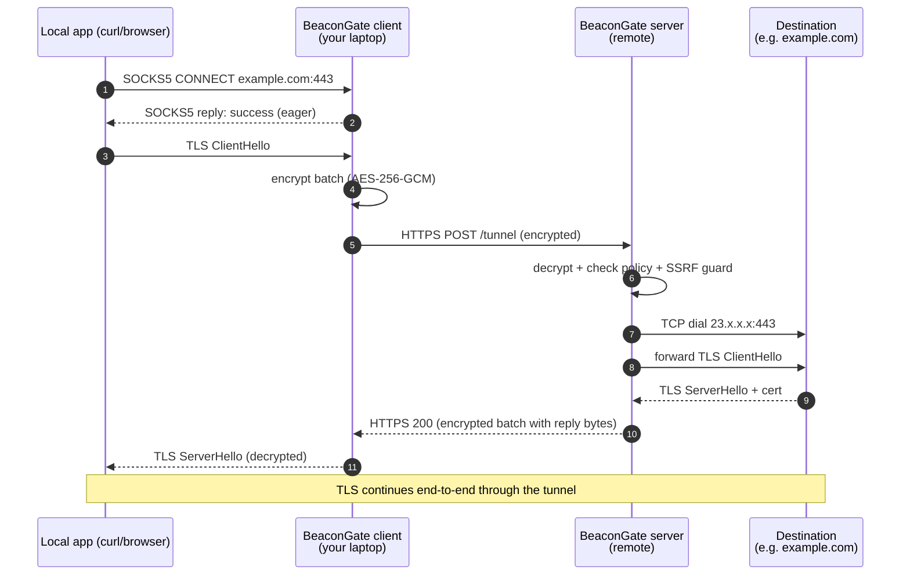

# BeaconGate Architecture

This document explains what BeaconGate is, how the pieces fit together,
and what every term in the codebase means. Read it before diving into
specific subsystems.

---

## 1. The idea in one paragraph

The user's machine cannot (or chooses not to) reach a destination on the
public internet directly. BeaconGate places **two processes** in the
path: one on the user's machine, one on a remote server the user
operates. They speak a small encrypted protocol over a transport. Local
apps point their proxy setting at the local BeaconGate process; their
traffic travels encrypted to the remote BeaconGate process, which makes
the real outbound TCP connection on their behalf.

> **Transport status (as of pre-v1.1):** the only transport that ships
> today is a **direct HTTPS POST** to an operator-configured URL
> (package `engine/transport/google`, named for historical reasons —
> being renamed to `https` in v1.1). It does NOT disguise the traffic
> as Google traffic; a network observer sees TLS to your operator's
> relay hostname.
>
> The **`appsscript` transport — the actual censorship-evasion path
> that tunnels through Google Apps Script so the wire looks like
> ordinary HTTPS to `script.google.com` — lands in v1.1**. Until then,
> use the `https` transport behind your own CDN / domain-fronting setup
> if you need on-path-censor evasion.

---

## 2. The naming gotcha (read this first)

Most networking guides use "client" and "server" to mean the two ends of
a connection. **BeaconGate uses these words differently** and that's
where everyone gets confused:

| Term in BeaconGate | What it actually is | Where it runs |
| --- | --- | --- |
| **Local app** | Your browser, `curl`, your IDE syncing — anything that wants to talk to the internet | User's laptop |
| **BeaconGate client** | A small Go process that pretends to be a SOCKS5 proxy to local apps and forwards their traffic encrypted | User's laptop (loopback only) |
| **BeaconGate server** | A Go process that receives the encrypted traffic, decides whether to allow it, and opens the real TCP connection to the destination | A remote VPS / cloud host |
| **Destination** (a.k.a. **upstream**) | The actual website or API the local app was trying to reach | Anywhere on the public internet |

So when the codebase says **client** it means *the BeaconGate process
running near you*, not your browser. When it says **server** it means
*the BeaconGate process running on a remote machine*, not the website
you're trying to visit. There are **four** parties in every request,
not two.

A simpler mental model: it's a tunnel. The two BeaconGate processes are
the two ends of the tunnel. Everything else passes *through* the
tunnel.

```
[ local app ]  →  [ BeaconGate client ]  ====tunnel====  [ BeaconGate server ]  →  [ destination ]
                  (your laptop)                          (a server you control)
```

---

## 3. Why two processes (and not one)?

The most natural follow-up question after §2 is: *why doesn't my local
app just talk to the BeaconGate server directly?* Or even simpler:
*why don't I just talk to the destination directly?*

Three things would have to be true for direct contact to work, and at
least one is usually broken:

1. The local app can **reach** the destination over the network.
   Often false: corporate firewall, censorship, geo-blocking, broken
   routing.
2. You're OK with the destination (and any network observer) seeing
   your **real IP and traffic patterns**. Sometimes false: privacy,
   evading IP-based abuse, jurisdictional concerns.
3. The route between you and the destination is **trusted**.
   Sometimes false: hostile network operator, public WiFi,
   surveillance.

If any of those is broken, *someone else* has to make the actual
outbound connection on your behalf. That "someone else" is the
BeaconGate server, running on a host that *can* reach the
destination.

But the server is on a different machine. Your apps run on your
laptop. So a third party — the BeaconGate **client** — has to live on
the laptop to receive local app traffic and forward it. There are
three reasons it has to exist as a separate process from the apps:

### Reason 1 — reachability: apps live here, the server lives there

Local apps send TCP packets to whatever the OS routing table allows.
If the destination is unreachable, removing the BG client doesn't
help: you can't make the local app teleport to a different network.
Something on the local machine has to catch the apps' traffic and
forward it through the tunnel.

### Reason 2 — protocol mismatch: local apps don't speak BeaconGate

A browser knows HTTPS. `curl` knows HTTPS, FTP, etc. None of them
know the BeaconGate envelope protocol (AEAD-encrypted JSON batch over
a fronting URL with sequence numbers and session IDs). They never
will — modifying every app on the planet is not on the table.

But they all know **SOCKS5**. SOCKS5 is the universal "use this
proxy" interface in operating systems, browsers, and command-line
tools.

The BG client's job is therefore **translation**:

```
Local app  ←─SOCKS5─→  BG client  ←─BeaconGate envelope─→  BG server  ←─TCP/TLS─→  Destination
   "I know         translation 1                translation 2            "I know
    SOCKS5"        (SOCKS↔BG)                 (BG→TCP outbound)           HTTPS"
```

### Reason 3 — multiplexing: many connections share one tunnel

A normal browser session opens dozens of TCP connections at once. The
BG transport is **one** outgoing path — typically one fronting URL,
one stream of HTTPS POSTs. The two BG ends multiplex many independent
local-app connections into that single transport and demultiplex on
the other side.

Without the BG client there is nothing to multiplex per-app
connections, and no app understands sharing a transport with another
app's traffic.

### Why not a one-process design?

You could imagine a single local-only binary:

```
Local app  ←─SOCKS5─→  Single Process  ←─direct TCP─→  Destination
```

That's a normal SOCKS proxy. It works **only when the local machine
can reach the destination directly** — i.e., when none of the three
"broken" conditions above are true. If your network blocks the
destination, this design has no escape hatch: the SOCKS proxy is on
the same blocked machine, so it is also blocked.

You need a process running on a **different** network to do the
dialing. Hence two processes, on two machines — even though the
"client" and "server" labels are confusing.

---

## 4. End-to-end data flow

What happens when you run `curl --proxy socks5h://127.0.0.1:1080
https://example.com`:

```
┌────────────────────────────────────────────────────────────────────────┐
│ Your laptop                                                            │
│                                                                        │
│   curl ──SOCKS5──▶ BeaconGate client ──┐                               │
│                       ▲                │                               │
│                       │                ▼                               │
│                       │         encrypts batch                         │
│                       │         (AES-256-GCM)                          │
│                       │                │                               │
│                       │                ▼                               │
│                       │     HTTPS POST  ────────────────────────┐      │
│                       │                                         │      │
│                  reads decrypted                                │      │
│                  reply                                          │      │
└─────────────────────────────────────────────────────────────────│──────┘
                                                                  │
                                  (network: HTTPS, looks like     │
                                   ordinary traffic to anyone     │
                                   inspecting it)                 │
                                                                  │
┌─────────────────────────────────────────────────────────────────│──────┐
│ Remote BeaconGate server                                        │      │
│                                                                 ▼      │
│        HTTPS handler ─▶ decrypts batch ─▶ checks policy ─▶ dials TCP   │
│        (long-polls until                  + SSRF guard       to        │
│         destination has data)                                ▼         │
│                ▲                                       ┌──────────┐    │
│                │                                       │ example. │    │
│                └─────────── reads response ◀───────────┤ com:443  │    │
│                                                        └──────────┘    │
└────────────────────────────────────────────────────────────────────────┘
```

Same diagram in [Mermaid](https://mermaid.live/) (GitHub renders this
inline):



Two important non-obvious facts about this flow:

- **TLS is end-to-end between the local app and the destination.** The
  BeaconGate server cannot read what curl sends or what example.com
  replies — it only sees encrypted TLS bytes flowing through. The
  encryption layer BeaconGate adds (AES-256-GCM) is on top of that,
  hiding the *fact* that you're using a tunnel from anyone watching the
  HTTPS POST traffic.
- **The server doesn't push data; the client polls.** HTTP is
  request/response. When the destination sends a TLS reply, the
  BeaconGate server stashes those bytes and waits. The client makes a
  request (carrying any new outbound bytes, or empty if idle); the
  server returns whatever's pending. This is "long-polling" — see §6.

---

## 5. Where the code lives

Top-level directory map (multi-language monorepo; only Go is built today):

```
cmd/                    Three Go binaries
  beacongate-client/      ← runs on user's laptop
  beacongate-server/      ← runs on the remote host
  beacongate-admin/       ← CLI to manage policy and mint keys

engine/                 Shared Go code used by BOTH client and server
  protocol/               Wire format: envelope, OPEN/DATA/CLOSE/RESET/PING/PROBE
  crypto/                 AES-256-GCM authenticated encryption
  session/                Session state machine
  config/                 JSON config loader
  transport/              Abstraction for "how do encrypted batches travel?"
    google/                 Direct HTTPS POST transport (renamed to `https` in v1.1).
                              NOT a Google-disguised path despite the name.
    appsscript/             (v1.1) Apps-Script-tunneled transport — the
                              actual censorship-evasion path
    transporttest/          httptest-style fakes for tests

client/                 BeaconGate client-only code
  runtime/                Protocol roundtrip + long-poll pump
  socks/                  SOCKS5 listener
  control/                Loopback HTTP API (status, health, diagnose)

server/                 BeaconGate server-only code
  runtime/                Tunnel HTTP handler + per-session bookkeeping
  upstream/               Outbound dialer with SSRF guard + DNS cache
  policy/                 Rule engine and file-backed store
  admin/                  HTTP API for managing policy at runtime

test/integration/       Go end-to-end tests across all layers

desktop/                (Phase 3, future) — not Go
mobile/                 (Phase 4, future) — not Go
protocol/               Cross-language protocol home (schemas/IDL later)
ops/                    Docker, systemd, baseline policy
docs/                   This document and the others
tools/                  Cross-language dev/build helpers (placeholder)
```

A package's location tells you who can use it:

- **engine/\*** — used by client and server. No transport-specific or
  endpoint-specific code lives here.
- **client/\*** — only the BeaconGate client process imports this.
- **server/\*** — only the BeaconGate server process imports this.
- Anything in `cmd/` is wiring; the actual logic is in the libraries.

---

## 6. Glossary of every term you'll see

### Wire / protocol terms

| Term | Definition |
| --- | --- |
| **Envelope** | One encrypted batch traveling over the transport. After AEAD-decryption, it parses to a JSON envelope containing one or more messages. The basic unit of communication. See [protocol.md](protocol.md). |
| **Message** | One protocol verb inside an envelope. Types: `OPEN`, `DATA`, `CLOSE`, `RESET`, `PING`, `PROBE`. |
| **OPEN** | "Start a new session to host:port." Sent by the client. The server validates against policy and dials. |
| **DATA** | "Here's a chunk of bytes for an existing session." Carries application bytes (e.g. TLS records). Has a sequence number. Optionally `compressed: true` if gzip-encoded. |
| **CLOSE** | "I'm done writing on my side of this session." Half-close, like TCP `FIN`. |
| **RESET** | "Abort this session." Carries a code (`POLICY_DENIED`, `BAD_SEQUENCE`, `DIAL_FAILED`, etc.). Like TCP `RST`. |
| **PING** / **PROBE** | Keepalive and version-negotiation messages. PROBE is also used as a benign payload for idle long-poll requests. |
| **Session** | One end-to-end TCP-like connection inside the tunnel. Identified by `(client_id, session_id)`. The local app sees this as a single TCP connection to the destination. |
| **Sequence number** (`seq`) | Monotonic per-session, per-direction counter. Out-of-order DATA triggers `RESET BAD_SEQUENCE`. |
| **Compression** | Per-message gzip when payload ≥ 256 bytes. Sender sets `compressed: true`; receiver gunzips, capped at 16 MiB to defend against bombs. |

### Architectural / code terms

| Term | Definition |
| --- | --- |
| **Transport** | The abstraction for *how* encrypted batches get from client to server. The shipping transport pre-v1.1 is **direct HTTPS POST** (the `engine/transport/google` package, renamed to `https` in v1.1) — it connects directly to the operator's relay URL and does NOT disguise the traffic as Google. The actual Google-tunneled censorship-evasion transport (`engine/transport/appsscript`) lands in v1.1. The protocol is transport-agnostic — adding QUIC, WebSocket, or another fronting path means a new package, not a rewrite. |
| **Pump** | The client's per-process request scheduler ([client/runtime/sessions.go](../client/runtime/sessions.go)). Maintains one in-flight HTTP request at a time; carries outbound traffic when there is any, otherwise sends a PROBE that the server holds open ("long-poll") so server-originated bytes can flow back. |
| **Long-poll** | Server-side technique to deliver data over a request/response transport. When the server has nothing to send, it holds the client's request open up to ~25 seconds, returning early as soon as upstream bytes arrive. Reduces idle bandwidth from ~13 req/s to ~1 req per 25s. |
| **Tunnel handler** | The server's HTTP handler at `/tunnel`. Decrypts, dispatches messages to sessions, drains pending upstream bytes, encrypts the response. |
| **Upstream dialer** | Server-side code that opens the real TCP connection to the destination. Always passes through the SSRF guard first. See [server/upstream/dialer.go](../server/upstream/dialer.go). |
| **SSRF guard** | A safety check on the server that refuses to dial private/loopback/link-local/multicast/cloud-metadata IP ranges. Prevents a malicious client from using the relay to scan the server's internal network. See [server/upstream/safety.go](../server/upstream/safety.go). |
| **Policy** | Server-side rules controlling which destinations the relay is willing to dial. Rules can match on hostname (exact / wildcard), IP, or CIDR, and can `allow`, `block`, or `log-only`. See [policy.md](policy.md). |
| **Baseline policy** | A small bundled block list (torrent trackers, default BitTorrent port). Operators add their own rules on top. |
| **Idle-session reaper** | Server-side goroutine that closes sessions idle for more than 10 minutes (configurable). Stops dead connections from holding upstream sockets forever. |
| **Per-client session cap** | Max concurrent sessions per `client_id` (default 100). One misbehaving client cannot exhaust the server. |

### Identity / auth terms

| Term | Definition |
| --- | --- |
| **client_id** | Stable identifier the client puts in every envelope. Lets the server isolate sessions per client. Not a credential — auth is by shared AEAD key. |
| **server_id** | Symmetric: the server's identity, written into responses. |
| **AEAD key** | A 32-byte secret shared between client and server. Both sides hold the same key; a client without the key cannot send a valid envelope, and a wrong-keyed envelope fails the AEAD tag check (server returns 401). |
| **Bearer token** | Optional credential for the server's admin API in remote mode. Different from the AEAD key. |

### Operational terms

| Term | Definition |
| --- | --- |
| **Tunnel path** | The HTTP path the server listens on for encrypted batches. Default `/tunnel`, configurable. |
| **Health path** | A simple `200 OK` endpoint for liveness checks. Default `/healthz`. |
| **Admin API** | A separate HTTP listener (default `127.0.0.1:9090`) for managing policy at runtime. Loopback-only by default, optionally bearer-token-authenticated for remote use. |
| **Control API** (client side) | Symmetric local-only HTTP API on the client (`127.0.0.1:9091`) so a desktop UI can read status, run diagnostics, etc. |
| **Profile** | A combined client config (server URL, key, transport options). Future desktop UI lets users switch between profiles. |

---

## 7. Why long-polling, and why it matters

HTTPS is a request/response protocol — the server cannot speak to the
client unless the client just made a request. If the BeaconGate client
only sent traffic when the local app had something to say, the
*reverse* direction (e.g. a TLS ServerHello, an HTML body) would queue
up at the server until the client happened to send something else.

Two extremes:

- **Naive polling** (what the v0 prototype did): client sends a probe
  every 75 ms when idle. Server replies with whatever's queued, or
  empty. Costs ~13 round-trips per second of idleness, ~13 KB/s of
  background bandwidth. Painful on metered connections.

- **Long-polling** (what BeaconGate does now): client sends one probe,
  server holds it open for up to 25 s, returning early the moment any
  upstream byte arrives or any local outbound traffic interrupts. ~1
  request per 25 s of idleness, ~40 B/s. Server-originated bytes still
  arrive within milliseconds because the server returns as soon as
  bytes are ready.

The long-poll budget (25 s) is below typical HTTP intermediary idle
timeouts (Cloudflare 100 s, nginx/Caddy 60 s) so no proxy will sever
the held connection.

---

## 8. Trust and threat model

Who has to trust whom:

- **The local app trusts the local BeaconGate client** to faithfully
  proxy its bytes. The client could read everything if it wanted to,
  except — see next bullet.
- **TLS protects the local app from the BeaconGate server.** The
  BeaconGate server only sees encrypted TLS bytes flowing through; it
  does not have the destination's private key, cannot MITM the TLS
  handshake, and does not know the plaintext.
- **The BeaconGate server trusts the AEAD key.** A correct AEAD
  signature from the client is the *only* authentication. Compromise
  of the key compromises every client and every session that key has
  ever protected. Per-client key derivation is on the v1.1 roadmap
  (see [protocol.md "Future Compatibility Notes"](protocol.md)).
- **The operator trusts the SSRF guard and the policy engine** to
  prevent the relay from being weaponized to scan internal networks or
  reach abuse-prone destinations. Both are on by default.
- **A network observer between client and server** sees only HTTPS
  POST traffic, padded and encrypted. They learn that *something* is
  using the relay endpoint, but not what destinations are visited or
  what bytes flow.
- **A network observer between server and destination** sees ordinary
  outbound TCP/TLS traffic from the server's IP. They cannot tell
  which client originated it.

---

## 9. Lifecycle of one HTTPS request, in code

For readers who want to follow it through the source:

1. `curl` opens a TCP connection to `127.0.0.1:1080` (the SOCKS5
   listener). Handled by [client/socks/server.go](../client/socks/server.go).
2. SOCKS5 handshake → CONNECT to `example.com:443`. The SOCKS server
   replies "success" *eagerly* (before the BeaconGate server has done
   anything) so curl can immediately send the TLS ClientHello.
3. The SOCKS handler calls `pump.Dial(target)`, which mints a
   `session_id` and queues an `OPEN` message. See `Pump.Dial` in
   [client/runtime/sessions.go](../client/runtime/sessions.go).
4. The pump's loop builds an envelope, encodes it as JSON, AEAD-seals
   it, POSTs it to the server's `/tunnel` URL via
   [engine/transport/google/client.go](../engine/transport/google/client.go).
5. Server's tunnel handler ([server/runtime/tunnel_handler.go](../server/runtime/tunnel_handler.go)):
   AEAD-opens, decodes, dispatches each message.
6. For the `OPEN`: enforce per-client session cap → run policy
   evaluator → dial via the upstream dialer (which runs the SSRF
   guard) → register a new `serverSession` → spawn `readUpstream` goroutine.
7. A `DATA` message in the same batch carries curl's TLS ClientHello.
   The handler writes those bytes to the upstream TCP socket.
8. example.com's TLS ServerHello arrives on the upstream socket. The
   `readUpstream` goroutine appends to the session's `pending` buffer
   and `notify`s the per-client signal channel.
9. Meanwhile the client's pump has issued an idle long-poll PROBE.
   Server's `collectUpstreamData` was waiting on the signal channel,
   wakes up, drains `pending` into DATA messages, encrypts, returns.
10. Client receives the response, decrypts, dispatches the DATA back
    to the session's inbox. The SOCKS bridge's `io.Copy` reads it from
    the session and writes it onto the curl TCP connection.
11. TLS handshake continues; HTTP/2 GET happens; HTML body returns;
    curl prints it.

---

## 10. What a developer should read next

In this order:

1. **[protocol.md](protocol.md)** — the full wire protocol. Normative;
   read this before changing anything in `engine/protocol`.
2. **[policy.md](policy.md)** — how outbound policy evaluation works.
3. **[admin-api.md](admin-api.md)** — REST surface for managing policy
   at runtime.
4. **[deployment.md](deployment.md)** — operator guide, systemd unit,
   Docker compose, recovery.
5. The package-level doc comments in the Go source — every package
   begins with a paragraph explaining its responsibility.

---

## 11. Future shape (not built yet)

- **Desktop product** ([../desktop/README.md](../desktop/README.md)) —
  a UI that talks to the local control API. Language TBD (Tauri,
  Electron, or native).
- **Mobile** ([../mobile/README.md](../mobile/README.md)) — strategy
  step before any code. iOS / Android subtrees reserved.
- **`appsscript` transport (v1.1)** — the censorship-evasion path that
  tunnels every batch through a user-deployed Google Apps Script web
  app, so the network path terminates at a real Google IP with
  `SNI=www.google.com` and HTTP `Host: script.google.com`. This is the
  property the project is named for; it is not yet implemented in
  `master`.
- **Per-client AEAD keys (v1.1)** — derived from a master via HKDF,
  with `client_id` in a small cleartext header so the server picks
  the right key before AEAD-opening. Lands together with the
  `appsscript` transport in the v1.1 protocol bump.
- **Replay protection (v1.1)** — timestamp + replay-id inside the
  AEAD, sliding-window dedup cache server-side. Lands with v1.1.
- **Additional transports beyond v1.1** — anything that can carry
  opaque encrypted batches: WebSocket, QUIC, Cloudflare Worker, etc.
  Each is a new package under `engine/transport/`.
